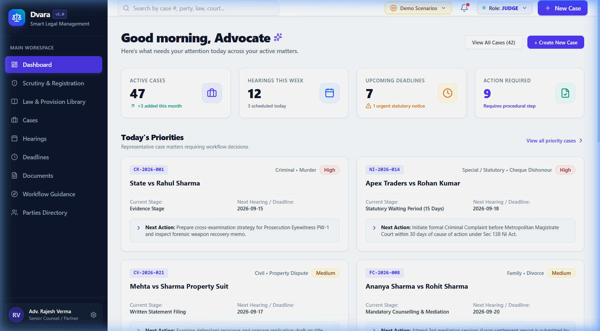

<div align="center">

  

  <p align="center">
    
  </p>

  <p align="center">
    <a href="https://skillicons.dev">
      
    </a>
  </p>

  <p align="center">
    
    
    
    
    
    
    
  </p>

  <p align="center">
    <strong>Dvara</strong> (Sanskrit for <em>Gateway / Threshold</em>) is an enterprise-grade judicial litigation platform modeling Indian civil & criminal procedural statutory law (<strong>CPC Order VIII</strong>, <strong>BNSS Sec 103</strong>, and <strong>Negotiable Instruments Act Sec 138</strong>).
  </p>

  <br />

  <p align="center">
    
  </p>
  <p align="center"><em>✨ Dvara Unified Judicial Cockpit — Advocate Priority Radar, Hearing Tracking & Scrutiny Workflow</em></p>

</div>

---

## 🌟 Key Features at a Glance

<table>
  <tr>
    <td width="50%">
      <h3>🔍 Digital Scrutiny & Deficiency Loop</h3>
      <p>Prevents invalid docketing. Scrutiny Officers inspect petition exhibits and raise structured statutory deficiencies that lock petition progress until advocates submit certified resolutions.</p>
    </td>
    <td width="50%">
      <h3>🏛️ Registration & Case Number Engine</h3>
      <p>Registrars audit verified petitions, allocate judicial courtrooms, and generate official unique case numbers (e.g. <code>CIV/2026/1024</code> or <code>CR/2026/001</code>).</p>
    </td>
  </tr>
  <tr>
    <td width="50%">
      <h3>⚡ Inter-Service Automated Docketing</h3>
      <p>Registration triggers asynchronous REST dispatch to the Hearing Service, automatically scheduling initial admission hearings and calculating statutory 30-day filing deadlines.</p>
    </td>
    <td width="50%">
      <h3>⚖️ Judicial Orders & Proceedings</h3>
      <p>Bench interface allowing judges to convene hearings, record attendance, and draft signed Interlocutory, Injunction, or Final Verdict orders.</p>
    </td>
  </tr>
  <tr>
    <td width="50%">
      <h3>🛡️ HMAC-SHA256 JWT & Strict RBAC</h3>
      <p>Stateless token authentication enforcing persona permissions across 5 distinct roles: <em>Judge, Registrar, Scrutiny Officer, Advocate, and Citizen</em>.</p>
    </td>
    <td width="50%">
      <h3>📜 Tamper-Evident Case Audit Trail</h3>
      <p>Permanent historical ledger tracking every stage transition, deficiency action, order issuance, and registration with actor timestamps.</p>
    </td>
  </tr>
</table>

---

## 🏛️ Distributed System Topology

```
                                  ┌────────────────────────┐
                                  │      REACT 19 SPA      │
                                  │ JavaScript (ES6+ / JSX)│
                                  │   (Port 5173 / Vite)   │
                                  └───────────┬────────────┘
                                              │
                                              │  HTTPS / REST (JWT Bearer)
                                              ▼
            ┌─────────────────────────────────┬────────────────────────────────┐
            │                                 │                                │
            ▼                                 ▼                                ▼
┌───────────────────────┐         ┌───────────────────────┐        ┌───────────────────────┐
│     Case Service      │         │   Workflow Service    │        │    Hearing Service    │
│       Port 8081       │         │       Port 8082       │        │       Port 8083       │
├───────────────────────┤         ├───────────────────────┤        ├───────────────────────┤
│ • E-Filing Lifecycle  │         │ • State Machine Rules │        │ • Hearing Scheduling  │
│ • Scrutiny Audit      │         │ • Next-Action Engine  │        │ • Cause List Gen      │
│ • Deficiency Loop     │         │ • Statutory Deadlines │        │ • Judicial Orders     │
│ • Case Registration   │         │ • CPC / BNSS Templates│        │ • Attendance Logs     │
│ • Audit Trail Logger  │         └───────────────────────┘        └───────────▲───────────┘
│ • JWT / Auth Provider │                                                      │
└───────────┬───────────┘                                                      │
            │                                                                  │
            └──────── Inter-Service REST (Registration Event) ─────────────────┘
                                              │
                                              ▼
                                ┌───────────────────────────┐
                                │     Document Service      │
                                │         Port 8084         │
                                ├───────────────────────────┤
                                │ • Filing Document Store   │
                                │ • Verification Badging    │
                                └───────────────────────────┘
```

---

## 🔄 End-to-End Procedural Flow

```
[Citizen / Advocate]
        │
        ▼
1. E-Filing Petition (Draft ➔ Submitted)  [Filing ID: FL-2026-XXXX]
        │
        ▼
2. Registry Scrutiny Review
   ├── Documents Deficient? ──> Raise Deficiency (OPEN) ──> Advocate Re-uploads ──> Resolved
   └── Documents Verified!
        │
        ▼
3. Registrar Registration Approval
   ├── Generates Official Case Number (e.g., CIV/2026/1024 or CR/2026/001)
   ├── Assigns Presiding Judge & Court Hall
   └── [Inter-Service Event] Triggers Hearing Service:
          ├── Automatically schedules preliminary admission hearing
          └── Creates 30-day statutory Written Statement deadline under CPC Order VIII
        │
        ▼
4. Procedural Next-Action Engine (Workflow Service)
   └── Dynamically recommends statutory deadlines & next actions based on stage
        │
        ▼
5. Hearing Proceedings & Order Issuance (Judge Persona)
   ├── Convenes Hearing (Prosecution / Defense Examination)
   └── Issues Interlocutory, Interim Injunction, or Procedural Court Orders
        │
        ▼
6. Immutable Case Audit Trail
   └── Records every transition, actor, timestamp, and state delta permanently
```

---

## 👥 Role-Based Access Control (RBAC) Matrix

| Persona / Role | Filing & Petitions | Scrutiny & Deficiencies | Registration Approval | Hearing Calendar | Judicial Orders | Audit Logs |
| :--- | :---: | :---: | :---: | :---: | :---: | :---: |
| **`CITIZEN` / Litigant** | Create & Submit | View & Resubmit | ❌ | View Own | View Orders | View Public |
| **`ADVOCATE`** | File Pleadings | Resolve Deficiencies | ❌ | View / Request | View Orders | Full Access |
| **`SCRUTINY_OFFICER`** | Audit | Raise / Verify | ❌ | View | View | Full Access |
| **`REGISTRAR`** | Manage | View All | ✅ Approve & Assign | Allocate Hall | Administrative | Full Access |
| **`JUDGE`** | Preside | View Record | View Record | Conduct / Adjourn | ✅ Issue Orders | Full Access |
| **`ADMIN`** | Full System | Full System | Full System | Full System | Full System | Full System |

---

## 📡 Microservices & REST API Reference

<details>
<summary><strong>🔍 Click to expand API endpoints documentation</strong></summary>

### 1. Case Service (`http://localhost:8081`)
| Method | Endpoint | Description | Auth Required |
| :--- | :--- | :--- | :--- |
| `POST` | `/api/v1/auth/login` | Authenticate user & issue signed HMAC-SHA256 JWT | Public |
| `GET` | `/api/v1/auth/token?role={role}` | Direct JWT token generator for demo persona switching | Public |
| `GET` | `/api/v1/cases` | Retrieve all master case dossiers | `Bearer JWT` |
| `POST` | `/api/v1/cases` | Submit new electronic petition | `Bearer JWT` |
| `POST` | `/api/v1/cases/{id}/deficiencies` | Raise statutory document deficiency | `SCRUTINY_OFFICER` |
| `PATCH` | `/api/v1/deficiencies/{id}/resolve` | Submit re-uploaded document resolution | `ADVOCATE`, `CITIZEN` |
| `POST` | `/api/v1/cases/{id}/register` | Approve scrutiny & issue Case Number | `REGISTRAR`, `ADMIN` |
| `GET` | `/api/v1/cases/{id}/audit` | Fetch tamper-evident case audit history | `Bearer JWT` |

### 2. Workflow Service (`http://localhost:8082`)
| Method | Endpoint | Description |
| :--- | :--- | :--- |
| `GET` | `/api/v1/workflows/templates/{caseType}` | Retrieve procedural stage flow (Pleadings, Evidence, etc.) |
| `GET` | `/api/v1/workflows/next-action/{caseId}` | Compute dynamic recommended statutory action & deadline |

### 3. Hearing Service (`http://localhost:8083`)
| Method | Endpoint | Description |
| :--- | :--- | :--- |
| `GET` | `/api/v1/hearings` | List scheduled hearings & daily cause list |
| `POST` | `/api/v1/hearings` | Schedule hearing docket date |
| `GET` | `/api/v1/deadlines` | List statutory & court-mandated deadlines |
| `POST` | `/api/v1/orders` | Draft, sign, and issue formal judicial orders |
| `GET` | `/api/v1/orders?caseId={id}` | Retrieve all judicial directions for a case |

### 4. Document Service (`http://localhost:8084`)
| Method | Endpoint | Description |
| :--- | :--- | :--- |
| `GET` | `/api/v1/documents?caseId={id}` | Retrieve uploaded petition exhibits & orders |
| `POST` | `/api/v1/documents` | Upload and verify electronic filings |

</details>

---

## 🧪 Automated Testing Suite

LexFlow includes a **JUnit 5 & Mockito test suite** validating critical business invariants:

```bash
# Run unit tests in case-service
cd backend/case-service
mvn test

# Run unit tests in workflow-service
cd backend/workflow-service
mvn test
```

### Key Tested Scenarios:
- `testRaiseDeficiency_SetsCaseStatusToDeficientAndLogsAudit()`: Verifies that flagging an exhibit immediately transitions the filing status to `DEFICIENT` and generates an audit log entry.
- `testResolveDeficiency_AllResolved_SetsStatusUnderScrutiny()`: Verifies that clearing open deficiencies automatically returns the dossier to `UNDER_SCRUTINY`.
- `testApproveRegistration_AssignsCaseNumberAndInvokesInterService()`: Verifies registration number allocation and mock dispatch to `hearing-service`.
- `testGenerateAndValidateToken_Success()` & `testValidateToken_TamperedToken_ReturnsFalse()`: Verifies HMAC-SHA256 signature verification and tamper rejection.
- `testComputeNextAction_DeficientStatus_ReturnsUrgentDocumentReupload()`: Verifies priority calculation for deficient petitions.

---

## 🚀 Quickstart & Local Setup

### 1. Start the React Frontend
```bash
cd frontend
npm install
npm run dev
```
Open **`http://localhost:5173/`** in your browser.

### 2. Start the Backend Microservices
All microservices come pre-configured with **H2 in-memory databases** by default (with automatic seed data), so no external MySQL setup is required to run:

```bash
# Terminal 1: Case Service (Port 8081)
cd backend/case-service
mvn spring-boot:run

# Terminal 2: Workflow Service (Port 8082)
cd backend/workflow-service
mvn spring-boot:run

# Terminal 3: Hearing Service (Port 8083)
cd backend/hearing-service
mvn spring-boot:run

# Terminal 4: Document Service (Port 8084)
cd backend/document-service
mvn spring-boot:run
```

*(Note: If backend services are offline, the frontend's built-in `safeFetch` mechanism seamlessly falls back to the realistic legal mock dataset so the UI remains 100% interactive.)*

---

## 🎭 Demo Personas for Reviewers & Interviewers

Switch personas at any time using the **Role Switcher** in the top-right header:

| Persona | Name | Credentials | Key Action to Demonstrate |
| :--- | :--- | :--- | :--- |
| **Judge** | Hon'ble Justice A. K. Sikri | `judge@dvara.gov` / `password` | Open Case Dossier ➔ Orders Tab ➔ Click **"Issue Formal Order"** |
| **Registrar** | Registrar V. K. Deshmukh | `registrar@dvara.gov` / `password` | Scrutiny Queue ➔ Click **"Approve Registration"** to allocate Case Number |
| **Scrutiny Officer** | Officer Priya Nair | `scrutiny@dvara.gov` / `password` | Scrutiny Queue ➔ Select Petition ➔ Click **"Raise Deficiency"** |
| **Advocate** | Adv. Rajesh Verma | `advocate@dvara.org` / `password` | Scrutiny Queue ➔ Click **"Respond & Submit Re-uploaded Document"** |
| **Litigant / Citizen** | Rohan Kumar | `citizen@dvara.org` / `password` | Track personal petition filing status & review hearing notices |

---

<div align="center">
  <sub>Built with ❤️ by <a href="https://github.com/Krishna0250">Krishna0250</a>. Licensed under the MIT License.</sub>
  <br /><br />
  
</div>
